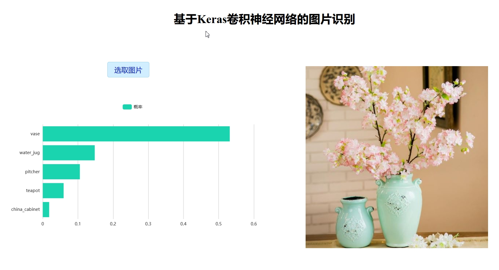

## Use Keras pre-trained CNN model to recognise image



## Build Setup

``` bash
# install dependencies
npm install

# serve with hot reload at localhost:8080
npm run serve

# build for production with minification
npm run build

# Lints and fixes files
npm run lint
```

## Used in project

  * Axios
  * Echarts
  * Vuetify
  * Vuex

## Android client is [here](https://github.com/yunTerry/Keras-Android)